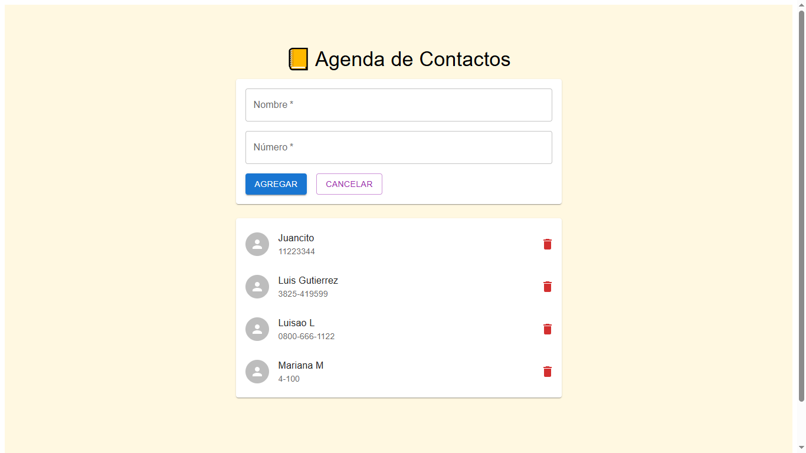
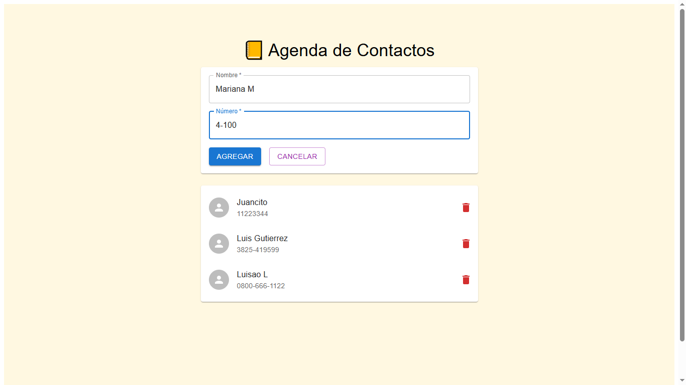
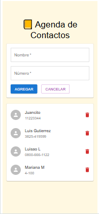

# 📒 Agenda Contacts

Aplicación fullstack para gestionar contactos personales.  
Permite **crear, listar, eliminar y editar (próximamente) contactos**, guardando los datos de forma persistente en un backend con **MongoDB Atlas**.  
El frontend está desarrollado con **React** y utiliza **Material UI** para los estilos.

---

## 🏷️ Badges


---

## 🚀 Tecnologías principales

- **Frontend:** React, Vite, Material UI
- **Backend:** Node.js, Express
- **Comunicación:** Axios
- **Persistencia:** MongoDB Atlas
- **Herramientas:** npm, Render

---

## 📁 Estructura del proyecto

```
/agenda-contacts
 ┣ 📂 frontend
 ┣ 📂 backend
 ┗ 📄 README.md (este archivo)
```

---

## 📸 Capturas

### Dashboard principal




### Agregar gasto



### Vista móvil



---

## ⚙️ Instalación y ejecución local

### 🔹 1. Clonar el repositorio

```bash
git clone https://github.com/tuusuario/agenda-contacts.git
cd agenda-contacts
```

### 🔹 2. Instalar dependencias

Frontend:

```
cd frontend
npm install
```

Backend:

```
cd ../backend
npm install
```

---

## 🧠 Scripts útiles

Frontend:

```
// Inicia el entorno de desarrollo del frontend
npm run dev
// Compila el frontend para producción
npm run build
```

Backend:

```
// Inicia el entorno de desarrollo del backend con nodemon
npm run dev
// Inicia el servidor en modo producción
npm start
```

---

## 🌐 Variables de entorno

Crear un archivo .env o .env.local dentro del frontend con:

```
VITE_API_URL=http://localhost:3001
```

⚠️ Si desplegás el backend en Render u otro servicio, actualizá la URL con el dominio correspondiente.
ejemplo: VITE_API_URL=https://agenda-contacts-api.onrender.com

En el backend, crear un archivo .env con:

```
MONGODB_URI=tu_conexion_de_mongodb_atlas
PORT=3001
```

---

## 🚀 Deploy

```
    Frontend: https://agenda-contacts.vercel.app

    Backend: https://agenda-contacts-api.onrender.com
```

Flujo de comunicación
El frontend (en Vercel) envía las solicitudes HTTP al backend (en Render), usando la URL configurada en VITE_API_URL.

## 🚧 Roadmap / Próximas mejoras

✏️ Edición de contactos
✅ Validación avanzada de formularios
🔍 Buscador de contactos
🔒 Autenticación de usuario
📄 Paginación o filtros por grupo
⚙️ Desarrollo y automatizcion de pruebas

---

## 📜 Licencia

Este proyecto está bajo la licencia MIT — ver el archivo LICENSE para más detalles.

## 👨‍💻 Autor

Luis Gutiérrez
Desarrollador web fullstack

```
    📧 luis.gut.11jm@gmail.com
    🌐 https://github.com/luisgutierrez11
```
